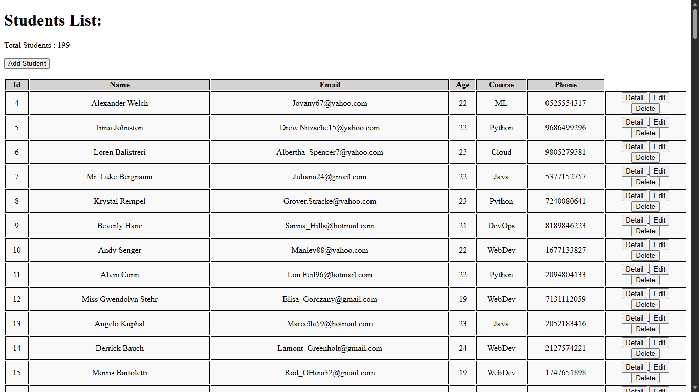

# Student Management System


## Project Overview
The **Student Management System** is a web-based application built with **Node.js, Express, EJS**, and **MySQL**.  
It allows managing student records with full **CRUD** functionality (Create, Read, Update, Delete) through a simple web interface.

## Features
| Feature | Description |
|---------|-------------|
| Add Student | Add new student records |
| Detail Students | List all students with details |
| Edit Student | Update student information |
| Delete Student | Remove student records |
| EJS Templates | Server-side rendered pages |
| REST Routes | Organized REST-style routing |
| Database | MySQL integration for persistent storage |
| Sample Data | Optional Faker/UUID generated data |

---


## Technologies Used
- **Backend:** Node.js, Express  
- **Templating:** EJS  
- **Database:** MySQL (`mysql2`)  
- **Additional Packages:**  
  - `method-override` for PUT/DELETE form support  
  - `@faker-js/faker` and `uuid` for generating sample data  

## Installation & Setup
1. Ensure **Node.js (v16+)** is installed and MySQL server is running.  
2. Clone the repository and navigate to the backend folder:

```bash
git clone https://github.com/yourusername/Student_Management_System.git
cd Backend
npm install

```
## Configure your database connection in Backend/sqlNodeConnection/db.js:

```bash

// Example:
host: 'localhost',
user: 'root',
password: 'your_password',
database: 'school'
```

## Generate sample student data:

```bash
node Backend/dataGen/studentGen.js
```

## Again:

```bash
cd Backend

```

## Running the Application

-   Start the server:

```bash
npm start
```

-   For development with automatic restarts (requires nodemon):
```bash
npm run dev
```

-   Open your browser and visit http://localhost:8080 (port: 8080/ 3000)

-   Use the web interface to manage student records easily.

---


## Application Routes

| Route                | Method | Description               |
| -------------------- | ------ | ------------------------- |
| `/students`          | GET    | View all students         |
| `/students/new`      | GET    | Form to add a new student |
| `/students`          | POST   | Create a new student      |
| `/students/:id`      | GET    | View student details      |
| `/students/:id/edit` | GET    | Edit student form         |
| `/students/:id`      | PUT    | Update student            |
| `/students/:id`      | DELETE | Delete student            |

##  Example URL (View All Students)
After starting the server, open:
```bash
http://localhost:8080/students
```
This route displays all student records stored in the MySQL database.


## License

-   This project is licensed under the MIT License. See the LICENSE file for details.
---


## Screenshots


